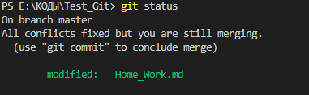
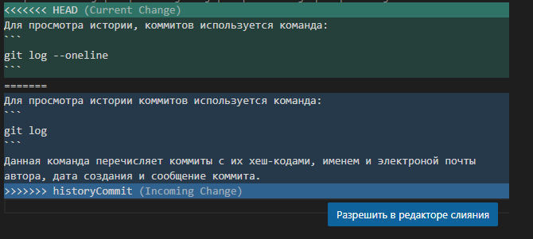

## 1. Установка `git` и `VScode`
1. Для того что бы начать работу с Git, на требуется устрановить две програмки.
* https://git-scm.com/downloads
* https://code.visualstudio.com

После того как мы установим данные программы. 
Нам требуется проинициализировать Git

* Заходим в `VSCode` и для дальнейшей работы нам потребуется терминал. Его можно вызвать сочитанием клавиш ctrl +. Или открываем вкладку "Вид" и там ищем "Терминал"

* Для проверки `git` нам потребуется команда `git version`
```
git version 2.38.0.windows.1

У нас высвитется что то на подобии этого
```
## 2. Нам надо познакомить `git` с нашим `VSCode`
Для того что бы познакомить `git` нам потребуется ввести две команды.
```
git config — global user.name “ваше_имя”
git config — global user.email “адрес_почты@email.com”
``` 
Теперь вы готовы к работе с `git` на локальном компьютере.

## 3. Иницилизация репрозитория
Получить репозиторий можно получить двумя способами.
1. В терминале переходим к папке в которой хотим создать репозиторий. 
```
Выполняем команду:
git init
```
2. Клонировать существующий репозиторий `git` из любого места.
```
Сделать можно так:
git clone "адрес репозитория"
```
## 4. Запись изменений в репозиторий

Каждый файл в рабочей папке (рипозитория)может находится в одном из двух состояний:
```
1. Под версионным контролем (отслеживаемые)
2. И неотслеживаемые
```
Отслеживаемые файлы могут быть неизмененными, измененными или подготовленными к комиту.
## 5. Просмотр истории коммитов
Для просмотра истории коммитов используется команда:
```
git log
```
Данная команда перечисляет коммиты с их хеш-кодами, именем и электроной почты автора, дата создания и сообщение коммита.
## 6. Добавляем файл в репозиторий отслеживания
1. Что бы отслеживать проект на потребуется следующия команда:
```
git add "имя_файла"
```
2. Или можем добавить сразу все файлы через команду:
```
git add .
```
## 7. Делаем фиксацию изменений и добавляем сообщение
1. Для того что бы зафиксировать изменения в нашем файле мы используем команду:
```
git commit
```
что бы добавить сообщение добавляем к нашей команде "-m (наше сообщение)"

2. Так же мы можем сохранить и добавить сообщения для всех файлов через команду:
```
git commit -am "наше сообщение"
```
При помощи этой команды все изменения в наших файлах сохраняются и добавляется сообщение.
## 8. Информация об изменениях или новых файлах
Для того что бы посмотреть статус об изменениях или есть какие то файлы. Используем команду:
```
git status
```
При помощи этого инструмента нам покажут все файлы которые имеются в нашем репозитории, так же те файлы которые уже отслеживаются или неотслеживаются.
Так же данная помогает нам посмотреть - были ли изменения в файле или нет.




Как видно из картинки выглядит это так.
## 9. Перемещение между коммитами 
Если случилось такое что нам требуется переместится на предыдущию версию файла.
Используем данную команду:
```
git checkout "хеш-код"
  *Достаточно первых пяти символов
```
При помощи данной команды мы можем переместится между так называемыми точками сохранения.
## 10. Создание веток и перемещение между ветками
Для того что бы проверить какие есть ветки и в какой на данный момент мы. Используем следующию команду:
```
git brach
```

Бывает такое что требуется черновит того как все будет выглядить. Для этого мы создаем отдельную ветку которую в будущем можем объединить с основной нашей ветной. Так называемые тестовые патчи - делаем через следующию команду:
```
git branch "название ветки"
```
В новой созданой ветки мы можем делать то что нам требуется и отправляеть на утверждение нашему заказчику.

* Что бы перейти в новую ветку, нам требуется следующия команда:
```
git checkout "название ветки"
```
После перехода мы можем редактировать как нам то требуется.

Для того что бы соединить ветки используем следующию команду:
```
git merge
    для слияния всех веток

git merge "названия ветки"
    для слияния одной ветки в основную
```    

!!!Важное примичание!!!
* Если мы будем соединять наши ветки и к примеру в одной и тоже срочке будет написанно разные значения - это вызовит конфликт и нам надо его исправить. 



Примерно так у вас будет выглятить конфликт.


### Что бы удалить ветку прописываем следующию команду:
```
git branch -d "название ветки"
   Перед удалением требуется сохраниться

git branch -D "название ветки"
   Удаляет без сохранений
```
## 11. Изменение последнего коммита
Бываеь такое что мы допустили ошибку в последнем коммите или его сообщении.
Для этого нам на помощь приходит команда:
```
git commit --amend
```
Это удобный способ изменить последний коммит. Она позволяет объединить проиндексированные изменения с предыдущим коммитом без создания нового коммита. Ее можно использовать для редактирования комментария к предыдущему коммиту без изменения в нем.

* Так же можно просто изменить сообщение через:
```
git commit --amend -m "измененное сообщение"
```
## 12. Добавление в игнор файлов
Часто бывает что у нас может быть куча файлов за которыми просто ну сложно следить. Либо мы добавляем картинку(ну что в картинке может поменятся кроме самой картинки). Для этого нам надо создать деректифу игнора
```
.gitignore
```
Создается она в нашем репозитории - выглядит следующим образом:


В самом файле нам требуется прописовать те файлы(расширения) которые пойдут в игнор.

К примеру:
```
1. gitignore.png
     определенный файл пойдет в игнор

2. *.png
    пойдет вся группа файлов в игнор
```
## 13. Добавление фото
Что бы добавить фото на требуется:
```

```
Где квадратные скобки пишем какое-то сообщение - оно потребуется для того если картинка не прогрузилась

Где круглые скобки - вставляем относительный путь к нашей картинки.

* Важно - картинки надо загрузить в ту папку где пишется основной файл и поместить данный файл в игнор.

## Все основные команды `git`
```
git init - инициализация локального репозитория.
git status - получение инфо от git о его текущем состоянии.
git add - добавить файл или файлы к комиту.
git commit -m "сообщение" - создание коммита и сообщения к нему.
git log - вывод истории всех коммитов с их хеш-кодами.
git branch - посмотреть список веток в репозитории.
git branch "название ветки" - создает новую ветку.
git checkout "название ветки или хеш-код коммита" - позволяет перемещятся между ветками или коммитами.
git branch -d "названия ветки" - удаляет ветку.
git commit --amend - позволяет сделать изменения в последнем коммите.
```

## Заключение
1. Мы научились устанавливать `git`
2. Мы проиницилизировали `git`
3. Научились добавлять файл к отслеживанию `git`-ом
4. Научились фиксировать изменение в файле и так-же остовлять сообщения
5. Научились добовлять так называемые сохранения(черновики) и делать слияния
6. Разобрались как менять сообщения и изменять в последней фиксации файла
7. Научились помещять файлы в игнор
8. Разобрались как подстовлять файлы картинки
9. Столкнулись с проблемами при слиянии веток и научились их решать
10. Разобрали все основные команды `git`